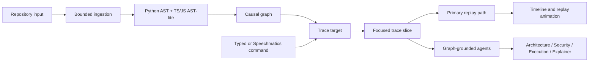

# Blitz TraceGrid

Blitz TraceGrid is a hackathon prototype for visual software causality. It ingests a demo fixture, a local repository path, or a public GitHub URL, extracts AST-lite structural signals, builds an evidence-backed causal graph, and turns one selected target into a focused trace slice with a replayable primary path.

The cleanest description is:

> TraceGrid helps people see how software appears to behave from source evidence, then explains that behavior with graph-grounded agents.

## What This App Actually Is

TraceGrid is not a generic code viewer. It is a graph-grounded execution intelligence demo with these layers:

1. Repository ingestion
2. Python AST plus TS/JS/TSX AST-lite extraction
3. Causal graph construction
4. Focused trace slicing
5. Primary replay path selection
6. Architecture, security, execution, and explainer agent reasoning
7. Optional voice control through typed commands or Speechmatics realtime speech

The app is built for the Milan AI Week hackathon narrative: make invisible software behavior visible, explainable, and replayable enough for a judged demo.

## Brutal Honesty

Current TraceGrid is a static causal reconstruction engine. It is not yet a production runtime tracer.

That means it currently infers likely behavior from source evidence such as files, imports, function declarations, API routes, click handlers, auth keywords, database calls, and call-like signals. The replay is symbolic and graph-based. It is not yet backed by OpenTelemetry, browser instrumentation, eBPF, debugger events, runtime logs, or real request traces.

This is intentional for the hackathon. The demo stays stable while still showing the product direction: runtime causal intelligence for software systems.

## What It Is For

TraceGrid answers practical questions like:

- What does this repository appear to contain?
- Which files, functions, API boundaries, UI events, auth boundaries, and data-touching nodes are connected?
- If I choose this node, what local execution context appears around it?
- What is the primary replay path TraceGrid can animate from that target?
- Which visible nodes carry static security risk signals?
- What would architecture, execution, security, and explainer agents say when grounded in the same graph?
- Which target should an autonomous AI investigation inspect first?

The real-world user flow is:

1. Paste a public GitHub URL or use a local repository path.
2. Click `Analyze Repository`.
3. Choose a `Trace Target` from the discovered nodes.
4. Watch TraceGrid build a focused trace slice.
5. Run `Replay Execution Flow`, `Agents Explain Graph`, `Highlight Security Risks`, or `Run AI Investigation`.

## Core Concepts

### Full Repository Graph

`Analyze Repository` builds the broad system map. This is the widest view. It is useful for seeing discovered files, imports, frontend events, API boundaries, auth/session signals, database signals, and other structural relationships.

### Trace Slice

`Trace Target` converts the full map into a smaller focused view around one selected node. It shows incoming context, outgoing branches, and bounded downstream continuation. This keeps the graph readable.

### Primary Replay Path

`Replay Execution Flow` animates one ordered path through the visible trace slice. The trace slice can show branches, but replay needs one route to animate clearly.

### Risk Signal

`none`, `low`, `medium`, and `high` are static review signals, not confirmed vulnerabilities.

- `none`: no obvious static risk signal was detected.
- `low`: weak or local control-flow signal.
- `medium`: boundary, state, identity, session, backend, API, or data-related signal.
- `high`: exposed, sensitive, auth/data-adjacent, or intentionally demo-highlighted risk path.

TraceGrid can point to places worth reviewing. It does not prove a path is safe or vulnerable without runtime evidence.

## Main Controls

| Control | What It Does |
| --- | --- |
| `Analyze Repository` | Builds the full repository graph from `__demo__`, a local path, or a public GitHub URL. |
| `Trace Target` | Lists discovered graph nodes. Selecting an exact suggestion automatically runs a focused trace. |
| `Click Moment Trace` | Runs the selected target. With an empty target in demo mode, it shows the full 8-node LoginButton path. |
| `Back` | Returns to the previous focused graph state. |
| `Full Graph` | Returns to the full repository graph without re-analyzing. |
| `Agents Explain Graph` | Runs graph-grounded architecture, security, execution, and explainer agents. |
| `Highlight Security Risks` | Highlights visible low, medium, and high static risk signals. |
| `Replay Execution Flow` | Animates the active primary replay path. |
| `Run AI Investigation` | Picks the riskiest or most connected target, traces it, runs agents, and outputs one verdict. |
| `Voice Control` | Routes typed or Speechmatics commands to real app actions. |

## Run AI Investigation

`Run AI Investigation` is the most agentic flow in the app. It performs a complete autonomous pass:

1. Uses the current graph or analyzes the configured repository.
2. Scores nodes by risk signal, direct graph connectivity, layer priority, and baseline importance.
3. Selects the highest-priority investigation target.
4. Generates a focused trace slice.
5. Runs architecture, security, execution, and explainer agents.
6. Outputs:

- Root Cause
- Attack Surface
- Primary Replay Path
- Recommended Fix
- Confidence
- Selection Score
- Plain English explanation

Selection score means "this node looks important for investigation." It does not automatically mean "this node is dangerous."

## Voice Control

TraceGrid supports two voice-control paths:

- Typed command mode: always available and demo-safe.
- Live Speechmatics mode: available when `SPEECHMATICS_API_KEY` is configured and the browser can access the microphone.

Supported command intents include:

- Analyze repository
- Trace a selected target
- Agents explain graph
- Highlight security risks
- Run AI investigation
- Replay execution flow

For public deployments, live microphone capture usually requires HTTPS. `localhost` is treated as secure by browsers, but a raw public `http://IP` address is not.

## Provider Integrations

Provider keys are optional. The app remains usable without them through deterministic demo behavior and local graph-grounded fallbacks.

### Featherless

Featherless can provide live LLM reasoning for selected agents when configured.

Relevant variables:

```env
FEATHERLESS_API_KEY=
FEATHERLESS_MODEL=Qwen/Qwen3-Coder-30B-A3B-Instruct
FEATHERLESS_BASE_URL=https://api.featherless.ai/v1
FEATHERLESS_TIMEOUT_SECONDS=2.8
TRACEGRID_LIVE_AGENT=none
```

`TRACEGRID_LIVE_AGENT` can be set to `execution`, `security`, or `explainer` to route that agent through live inference. Keeping it as `none` uses local graph reasoning only.

### Speechmatics

Speechmatics powers realtime speech-to-command input through the backend WebSocket proxy.

Relevant variables:

```env
SPEECHMATICS_API_KEY=
SPEECHMATICS_MP_URL=https://mp.speechmatics.com
SPEECHMATICS_JWT_TTL_SECONDS=60
SPEECHMATICS_RT_URL=wss://eu2.rt.speechmatics.com/v2
SPEECHMATICS_AUTH_QUERY=jwt
SPEECHMATICS_LANGUAGE=en
SPEECHMATICS_OPERATING_POINT=enhanced
```

Do not expose the Speechmatics API key to frontend build arguments. It belongs only in the backend runtime environment.

## Architecture



## Repository Ingestion

TraceGrid accepts:

- `__demo__` for the deterministic LoginButton hackathon fixture.
- A local repository path accessible to the backend container.
- A public GitHub URL in this form:

```text
https://github.com/{owner}/{repo}
```

GitHub ingestion is intentionally bounded:

- Only public GitHub HTTPS URLs are accepted.
- The backend downloads a ZIP archive to a temporary directory.
- The temporary directory is deleted after analysis.
- Scanning is limited by supported file extensions, max file count, and max file size.
- Demo fallback is allowed only for `__demo__`, so real repository failures stay visible.

## Demo Fixture

The built-in demo fixture is the judged-safe LoginButton flow:

```text
LoginButton
-> onClick handler
-> POST /api/auth/login
-> Auth handler
-> Auth middleware
-> User DB query
-> Token service
-> Session store
```

This fixture exists so the presentation can continue even if provider keys, GitHub, or network conditions fail.

## Local Run

Create a local environment file:

```powershell
Copy-Item .env.example .env
```

Start the stack:

```powershell
docker compose up -d --build
```

Open:

```text
http://localhost:3000
```

Backend health:

```powershell
Invoke-RestMethod http://localhost:8000/health
```

## Production-Style Run

This matches the Vultr deployment shape: Nginx is public, frontend/backend are internal.

```bash
cp .env.prod.example .env
docker compose -f docker-compose.prod.yml --env-file .env up -d --build
```

Open:

```text
http://localhost
```

Health:

```bash
curl http://localhost/health
```

## Vultr Notes

On Vultr, keep only Nginx public.

Recommended public ports:

- `80` for HTTP
- `443` for HTTPS after a domain is configured
- `22` for SSH, ideally restricted to your IP

Keep these private:

- `3000` frontend container
- `8000` backend container
- `6379` Redis
- `7474` Neo4j browser
- `7687` Neo4j Bolt

Neo4j and Redis are included for future architecture direction. The current hackathon demo does not require them for the main graph, trace, agent, replay, or voice flows.

For HTTPS and Speechmatics microphone support, see `DOCKER_DEPLOYMENT.md`.

## Environment And Secrets

Real `.env` and `.env.prod` files must not be committed to GitHub. GitHub is the code source only. Provider keys must be configured on the machine or server that runs the app.

Use these templates:

- `.env.example`
- `.env.prod.example`

Minimum useful values:

```env
ALLOW_GITHUB_INGESTION=true
GITHUB_CLONE_TIMEOUT_SECONDS=25
TRACEGRID_LIVE_AGENT=none
```

Optional provider values:

```env
FEATHERLESS_API_KEY=
SPEECHMATICS_API_KEY=
```

## Current Limitations

TraceGrid is intentionally hackathon-grade today. The important limitations are:

- No real runtime telemetry yet.
- No deterministic request replay yet.
- No OpenTelemetry, browser event hooks, eBPF, or debugger-backed traces yet.
- Security findings are static risk signals, not confirmed vulnerabilities.
- TS/JS analysis is AST-lite, not full TypeScript compiler symbol resolution.
- Cross-file and framework-aware control flow is bounded and heuristic.
- Speechmatics live microphone requires browser microphone permission and secure context.

These limitations are acceptable for the current demo, but they are exactly where the product should evolve after the hackathon.

## Roadmap

The next serious upgrades are:

- Real runtime evidence through OpenTelemetry or browser/backend instrumentation.
- Stronger TypeScript compiler-based symbol resolution.
- Deeper framework-aware route and handler mapping.
- Taint and data-flow analysis for auth, session, token, and database paths.
- Runtime event capture for true replay semantics.
- Persistent graph storage and historical comparison.
- Enterprise controls for audit trails, access control, and evidence export.

## Hackathon Positioning

Do not pitch TraceGrid as another code graph tool.

The strongest positioning is:

> AI can write software. Blitz TraceGrid explains what the software is actually doing.

For judges, the correct frame is:

- Static graph reveal shows the system map.
- Trace Target shows a focused causal slice.
- Replay Execution Flow turns the selected path into a software movie.
- Agents explain the same graph from architecture, security, execution, and human narrative perspectives.
- AI Investigation shows autonomous graph-grounded reasoning.

This keeps the demo honest, understandable, and aligned with the actual app.
